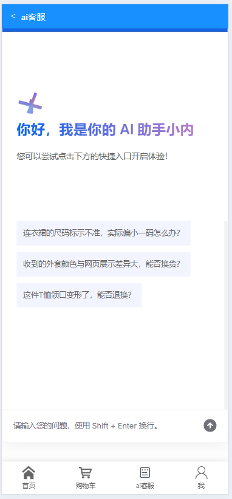
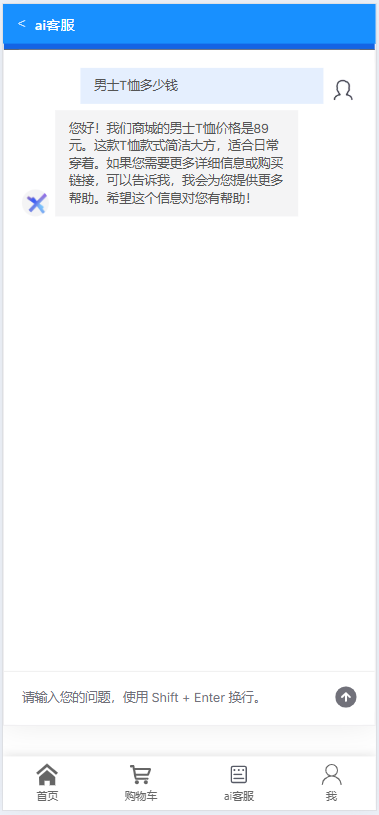
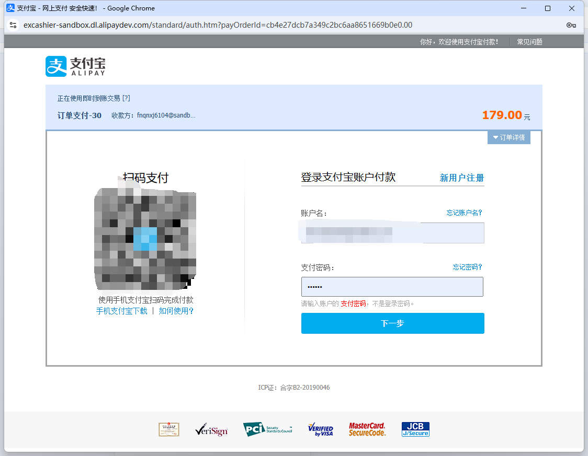
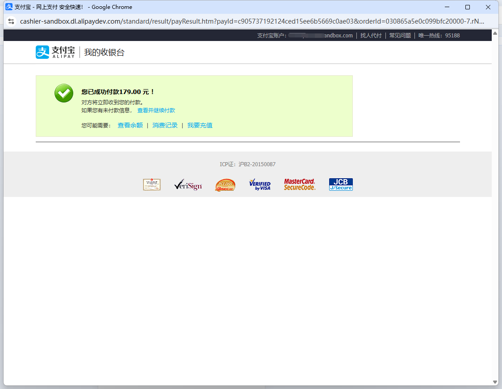

# 商城用户端项目

## 项目概述
本项目是一个基于Spring Boot的电商平台，集成了商品展示、用户管理、购物车、订单管理以及AI客服等功能。项目采用前后端分离架构，后端提供RESTful API接口，前端通过HTTP请求与后端交互。

## 技术栈

### 后端技术
- **Spring Boot 2.6.13**: 核心框架
- **Spring Security**: 安全认证
- **Spring Data JPA**: 数据持久层
- **MySQL 8.0**: 数据库
- **JWT**: 用户认证
- **阿里支付SDK**: 支付功能
- **阿里百炼 DashScope SDK**: AI客服功能

### 前端技术
- **Vue.js**: 前端框架
- **Element UI**: UI组件库
- **Axios**: HTTP客户端
- **SSE (Server-Sent Events)**: 实现AI客服流式响应

## 功能模块

### 1. 用户管理
- 用户注册
- 用户登录
- 用户信息管理

### 2. 商品管理
- 商品展示
- 商品分类
- 商品搜索
- 商品详情

### 3. 购物车
- 添加商品到购物车
- 修改购物车商品数量
- 删除购物车商品
- 购物车结算

### 4. 订单管理
- 创建订单
- 订单支付
- 订单查询
- 订单详情

### 5. 支付功能

#### 支付宝沙箱支付集成

本项目集成了支付宝沙箱环境进行支付测试和开发，具体实现包括：

- **配置信息**：
  - 应用ID (APPID)：9021000145621319
  - 支付宝网关：https://openapi.alipaydev.com/gateway.do
  - 签名方式：RSA2 (SHA256withRSA)

- **核心功能**：
  - 订单创建与支付请求生成
  - 支付状态查询
  - 异步通知处理
  - 退款处理

- **技术实现**：
  - 使用支付宝官方SDK (alipay-sdk-java 4.34.0.ALL)
  - 支持PC端和移动端支付场景
  - 通过Spring Boot配置自动初始化支付宝客户端

- **安全措施**：
  - 签名验证确保支付请求的完整性
  - 异步通知验签防止伪造回调
  - 订单号唯一性校验

- **测试账号**：
  - 买家账号：提供沙箱环境测试账号，便于开发测试
  - 商家账号：使用沙箱商家账号接收支付

- **开发流程**：
  1. 用户下单后生成商户订单
  2. 调用支付宝接口生成支付表单
  3. 用户完成支付操作
  4. 支付宝异步通知商户支付结果
  5. 系统验证支付结果并更新订单状态

### 6. AI客服系统

#### 技术实现
AI客服系统基于阿里百炼（DashScope）大模型API实现，具有以下特点：

- **流式响应**: 采用Server-Sent Events (SSE)技术，实现打字机效果的流式响应
- **多线程处理**: 使用线程池管理并发请求，提高系统响应能力
- **智能问答**: 基于阿里百炼大模型，能够理解用户问题并给出准确回答

#### 核心代码
```java
@PostMapping("/chat")
public ResponseBodyEmitter streamData(@RequestBody String query) {
    ResponseBodyEmitter emitter = new ResponseBodyEmitter(180000L);
    executor.execute(() -> {
        try {
            JsonObject jsonObject = JsonParser.parseString(query).getAsJsonObject();
            streamCall(emitter, jsonObject.get("prompt").getAsString());
        } catch (Exception e) {
            e.printStackTrace();
            emitter.completeWithError(e);
        }
    });
    return emitter;
}

public void streamCall(ResponseBodyEmitter emitter, String query) throws Exception {
    // 配置百炼应用参数
    ApplicationParam param = ApplicationParam.builder()
            .appId("your_id")
            .apiKey("your_key")
            .prompt(query)
            .incrementalOutput(true)
            .build();
    //将API Key配置到环境变量 https://help.aliyun.com/zh/model-studio/developer-reference/configure-api-key-through-environment-variables

    // 调用百炼API并处理流式响应
    Application application = new Application();
    Flowable<ApplicationResult> result = application.streamCall(param);
    AtomicInteger counter = new AtomicInteger(0);
    result.blockingForEach(data -> {
        int newValue = counter.incrementAndGet();
        String resData = "id:" + newValue + "\nevent:result\n:HTTP_STATUS/200\ndata:" + new Gson().toJson(data) + "\n\n";
        emitter.send(resData.getBytes(StandardCharsets.UTF_8));

        if ("stop".equals(data.getOutput().getFinishReason())) {
            emitter.complete();
        }
    });
}
```

#### 功能特点
- **智能商品推荐**: 根据用户浏览和购买历史，推荐相关商品
- **订单查询**: 用户可以通过AI客服查询订单状态
- **问题解答**: 解答用户关于商品、配送、退款等常见问题
- **7x24小时服务**: 全天候为用户提供在线咨询服务

#### 使用方法
1. 在商品页面或订单页面点击"在线客服"按钮
2. 在对话框中输入您的问题
3. AI客服会实时回答您的问题，支持连续对话

## 部署信息
- 项目访问地址: http://121.41.108.215:5173/

- （网址打开不了就是服务器到期了ξ( ✿＞◡❛)，希望大家尽量不要进行修改删除操作，谢谢大家的配合(´・ω・`)。若数据遭到恶意修改删除请联系管理员QQ:1411498103）

- 服务器管理不易，如果觉得项目对您有益，请支持多多一下我们，谢谢(✿◠‿◠)

  


## 开发环境搭建
1. 克隆项目到本地
2. 配置MySQL数据库
3. 修改`application.yml`中的数据库连接信息
4. 运行项目
5. 若ai客服配置不成功请参考官方文档：https://help.aliyun.com/zh/model-studio/use-cases/add-an-ai-assistant-to-your-website-in-10-minutes#dfa9e9c517sbk
## 项目截图

### AI客服功能演示


### AI客服功能演示2


### 支付功能


### 支付结果


### 商品展示


## 贡献者
- 开发团队

## 许可证
MIT License 